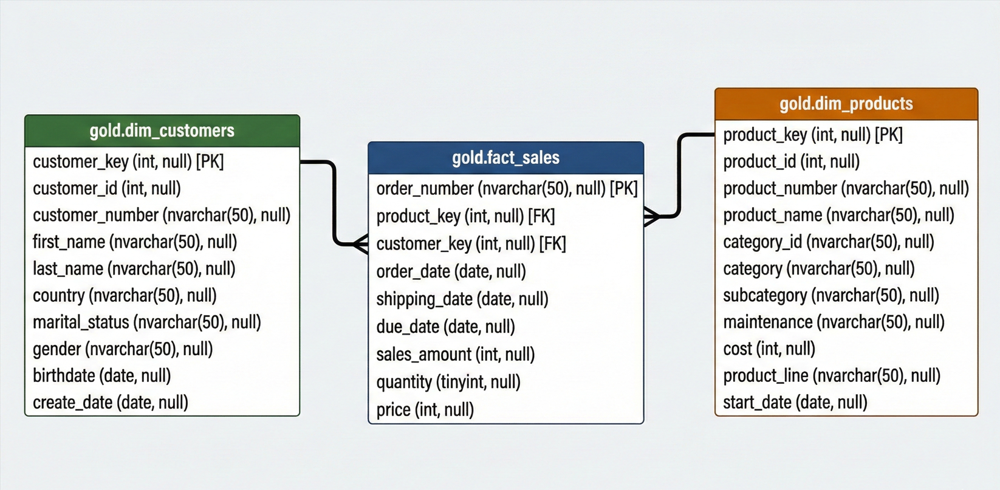
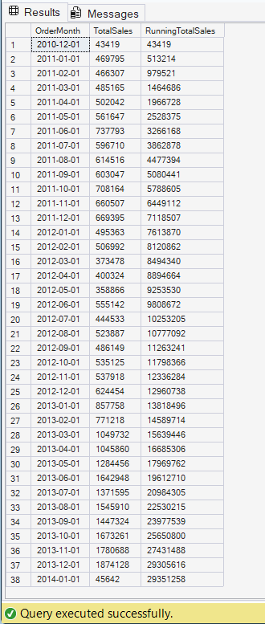
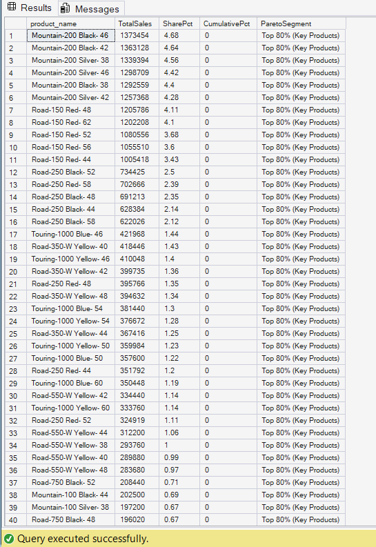
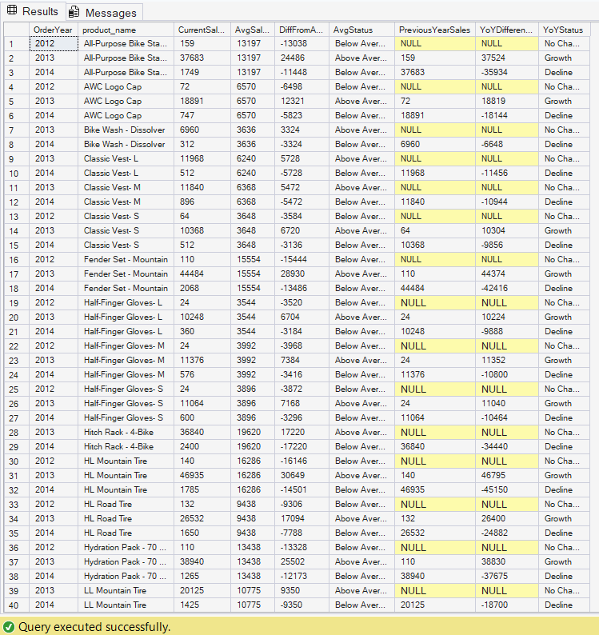

# 🛒 Advanced Sales Analytics & Data Warehousing (SQL)


---

## 📌 Project Overview

This project demonstrates an end-to-end SQL-based data analytics solution for a retail business.

The objective was to perform advanced business analysis using SQL Server.

The project applies advanced SQL techniques such as **Window Functions, CTEs, Running Totals, Moving Averages, Revenue Contribution Analysis, Year-over-Year (YoY) comparisons, and Customer Segmentation** to generate actionable business insights.

---

## 🎯 Business Problem

The retail company aims to:

- Track sales performance over time  
- Identify high-performing products and categories  
- Understand customer purchasing behavior  
- Measure revenue contribution across segments  
- Build analytical reporting views for business intelligence  

This project addresses these challenges by structuring raw data into a scalable warehouse model and performing deep SQL-driven analysis.

---

## 🏗 Data Architecture

The project follows a **Star Schema Data Warehouse design**.

### Fact Table
- `fact_sales` → Stores transactional sales data

### Dimension Tables
- `dim_customers`
- `dim_products`

### Analytical Layer
- `gold` schema used for reporting views

This architecture enables scalable reporting, simplified joins, and optimized analytical queries.



---

## 📂 Repository Structure

```text
sql-advanced-sales-analytics/
│
├── datasets/                    # Raw CSV Data (Customers, Products, Sales)
├── sql_scripts/                 # Modular SQL Scripts
│   ├── 01_database_setup.sql
│   ├── 02_change_over_time.sql
│   ├── 03_cumulative_analysis.sql
│   ├── 04_performance_analysis.sql
│   ├── 05_part_to_whole_analysis.sql
│   ├── 06_data_segmentation.sql
│   ├── 07_customer_report_view.sql
│   └── 08_product_report_view.sql
│
├── assets/                      # ER Diagram & Analysis Screenshots
└── README.md
```

---

## 📊 Key Business Insights

### 1️⃣ Sales Trends & Growth

- Significant revenue growth observed across years.
- Strong year-over-year performance improvement in later periods.
- Monthly breakdown reveals clear seasonal patterns.

**Business Impact:**  
Supports strategic planning, forecasting, and growth evaluation.

---

### 2️⃣ Cumulative Growth Analysis

- Running totals highlight sustained long-term growth.
- Moving averages smooth short-term fluctuations to reveal trend direction.

**Business Impact:**  
Helps leadership assess overall business momentum.



---

### 3️⃣ Product Performance (Pareto Analysis)

- A small percentage of products contribute the majority of total revenue.
- Revenue concentration indicates dependency on key categories.

**Business Impact:**  
Supports cross-selling strategies and revenue diversification planning.



---

### 4️⃣ Customer Segmentation

Customers classified into:

- **VIP** → Long-term high spenders  
- **Regular** → Consistent moderate spenders  
- **New** → Recently acquired customers  

**Business Impact:**  
Enables targeted marketing strategies and customer retention planning.

---

### 5️⃣ Year-over-Year (YoY) & Month-over-Month (MoM) Analysis

- Used `LAG()` window function to compare historical performance.
- Identified product-level and customer-level performance shifts.

**Business Impact:**  
Supports performance benchmarking and strategic adjustments.



---

## 🛠 Technical Skills Demonstrated

### Advanced SQL
- Window Functions (`SUM() OVER`, `AVG() OVER`)
- `LAG()` for YoY & MoM comparisons
- Running Totals
- Moving Averages
- Common Table Expressions (CTEs)
- CASE-based segmentation
- Analytical View creation

### Business Analytics
- Time-Series Analysis
- Revenue Contribution (Pareto Principle)
- Customer & Product Segmentation
- KPI development
- Performance comparison analysis

---

## 📈 Analytical Reports Built

### Customer Report (`gold.report_customers`)
Includes:
- Total Orders
- Total Sales
- Total Quantity
- Recency
- Customer Lifespan
- Average Order Value
- Average Monthly Spend
- Segmentation Category

### Product Report (`gold.report_products`)
Includes:
- Total Orders
- Total Sales
- Total Quantity
- Recency
- Product Lifespan
- Average Selling Price
- Revenue-Based Segmentation

---

## 🚀 How to Run This Project

### 1️⃣ Clone Repository
```bash
git clone https://github.com/YOUR_USERNAME/sql-advanced-sales-analytics.git
```

### 2️⃣ Set Up Database
- Open `01_database_setup.sql` in SQL Server Management Studio (SSMS)
- Execute the script to create:
  - `DataWarehouseAnalytics` database
  - `gold` schema
  - Required tables

### 3️⃣ Import CSV Files
- Import datasets from the `/datasets` folder into respective tables

### 4️⃣ Run Analysis Scripts
Execute scripts in order:
- 02 → 06 for analysis
- 07 & 08 to create reporting views

### 5️⃣ Query Final Reports
```sql
SELECT * FROM gold.report_customers;
SELECT * FROM gold.report_products;
```

---

## 💡 Why This Project Matters

This project simulates a real-world business analytics scenario where structured data modeling and advanced SQL techniques are used to generate strategic insights for decision-makers.

It demonstrates practical, job-ready skills aligned with Data Analyst and Business Intelligence roles.

---

## 🔮 Future Improvements

- Build a Power BI dashboard on top of reporting views
- Add indexing & query optimization
- Automate ETL workflow
- Deploy in a cloud-based SQL environment

---

## 👨‍💻 Author

**Sanjay Elagandula**  
Data Analyst | B.Tech CSM  

Tools: SQL Server  

LinkedIn: https://www.linkedin.com/in/sanjay-elagandula-es80as92  

---

> ⭐ If you found this project insightful, feel free to star the repository.
